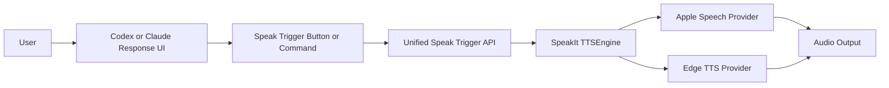
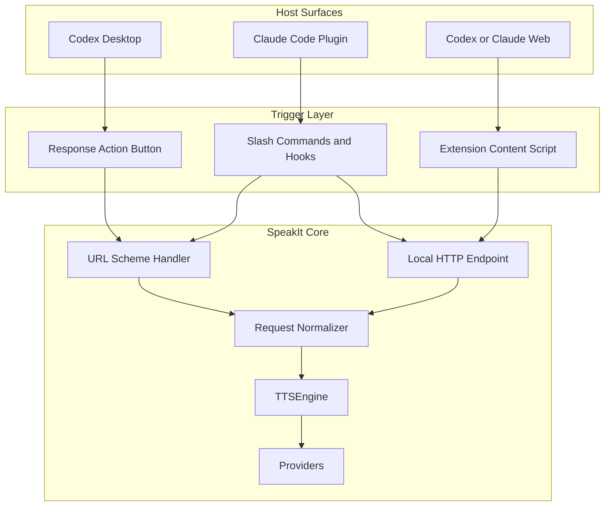
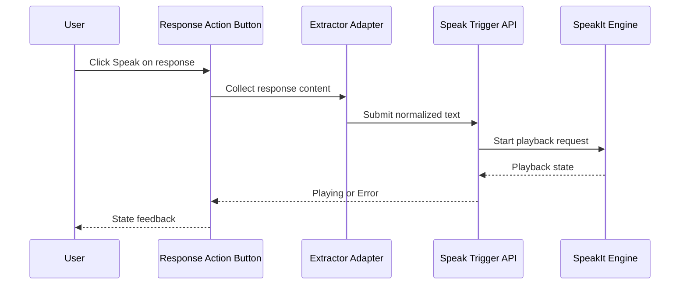
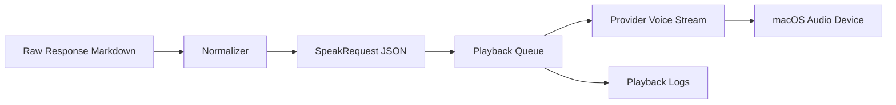

# Codex Response Speak Action and SpeakIt Integration

## Context
SpeakIt already provides system-wide macOS text-to-speech, a Claude Code plugin, a URL scheme handler, and an optional Chrome extension. The next goal is to rebuild and harden this functionality for current workflows and add a Codex-focused response speak action that feels native to response controls.

Constraints include: the official Codex desktop UI cannot be directly modified from this repository unless an extension/injection point is explicitly exposed; therefore the architecture must support both first-class native hooks (if available) and fallback trigger surfaces (plugin command, URL scheme, local API, or browser extension action).

## Decision
Adopt a layered integration design:
1. Stabilize and modularize SpeakIt core playback and provider orchestration.
2. Define a single "speak response" interface exposed through URL scheme and local HTTP endpoint.
3. Integrate Codex/Claude tooling through plugin hooks and message extraction adapters.
4. Implement UI-trigger surfaces per host capability:
- Native action button placement when Codex plugin host exposes a response-action API.
- Fallback injected button on supported web surfaces (Codex/Claude web UI) via extension.
- Guaranteed command fallback via slash command and hook.

This design avoids blocking on a single platform integration path and preserves one speech pipeline regardless of trigger source.

## Alternatives Considered
1. Only implement a browser-extension button and skip native hooks.
Tradeoff: fastest delivery but misses desktop-first and plugin-native experiences.

2. Wait for confirmed official Codex response-action API before starting.
Tradeoff: cleanest integration but delays value and risks dependency on unknown timeline.

3. Fork SpeakIt into a Codex-specific app.
Tradeoff: higher maintenance and code divergence; rejected in favor of branch/worktree-based evolution.

## Implementation Plan
1. Baseline and architecture cleanup
- Audit existing modules (`TTSEngine`, providers, `URLSchemeHandler`, `ClipboardWatcher`, plugin hooks).
- Define stable contracts: `SpeakRequest`, `SpeakSource`, `SpeakAction` and normalized text sanitizer.
- Add deterministic queue/interruption behavior for play/pause/stop/replace.

2. Unified trigger API
- Extend `speakit://` routes for `speak-response` and `speak-selection` payloads.
- Add optional localhost endpoint (`/v1/speak`) with token-based local auth.
- Add structured logging for request source and playback outcome.

3. Codex/Claude adapter layer
- Add adapter that can parse response text blocks safely (markdown flattening and table normalization).
- Add plugin-level hook endpoint invocation from Claude/Codex command workflows.
- Preserve slash command fallback (`/speak`, `/speak-file`, `/speak-stop`).

4. Response action button integration
- Track host capability matrix:
  - Codex desktop native response-actions API available: implement native button registration.
  - No API available: inject action button through extension/content script on supported web host.
- Button behavior: extract current response text -> call unified trigger API -> reflect state (loading/playing/error).

5. UX and accessibility
- Ensure keyboard shortcut parity for response-speak action.
- Add visible status and retry path when extraction fails.
- Verify voice/rate persistence and engine fallback behavior.

6. Test and release
- Add integration tests for trigger API and adapter normalization.
- Add manual QA matrix across Apple Silicon + Intel, Claude desktop, Codex web/desktop (where available), and browser extension surfaces.
- Update docs, install instructions, and troubleshooting.

## Risks and Mitigations
- Risk: Codex desktop does not expose custom response-action API.
Mitigation: ship extension and command-trigger fallback path first with the same backend API.

- Risk: UI structure changes break selector-based extraction/injected button.
Mitigation: use resilient selectors, feature flags, host-version guardrails, and telemetry/logging for failure detection.

- Risk: Speech quality/regressions across engines.
Mitigation: keep provider abstraction, add provider health checks, and expose deterministic fallback order.

- Risk: Permission friction on macOS (Accessibility, Gatekeeper, TCC path binding).
Mitigation: improve first-run checks, explicit diagnostics, and recovery steps in menu/help.

## High-Level Diagram (Mermaid)

## Architecture Diagram (Mermaid)

## Flow Diagram (Mermaid)

## Data Flow Diagram (Mermaid)

---
Saved from Codex planning session on 2026-05-16 19:43.
